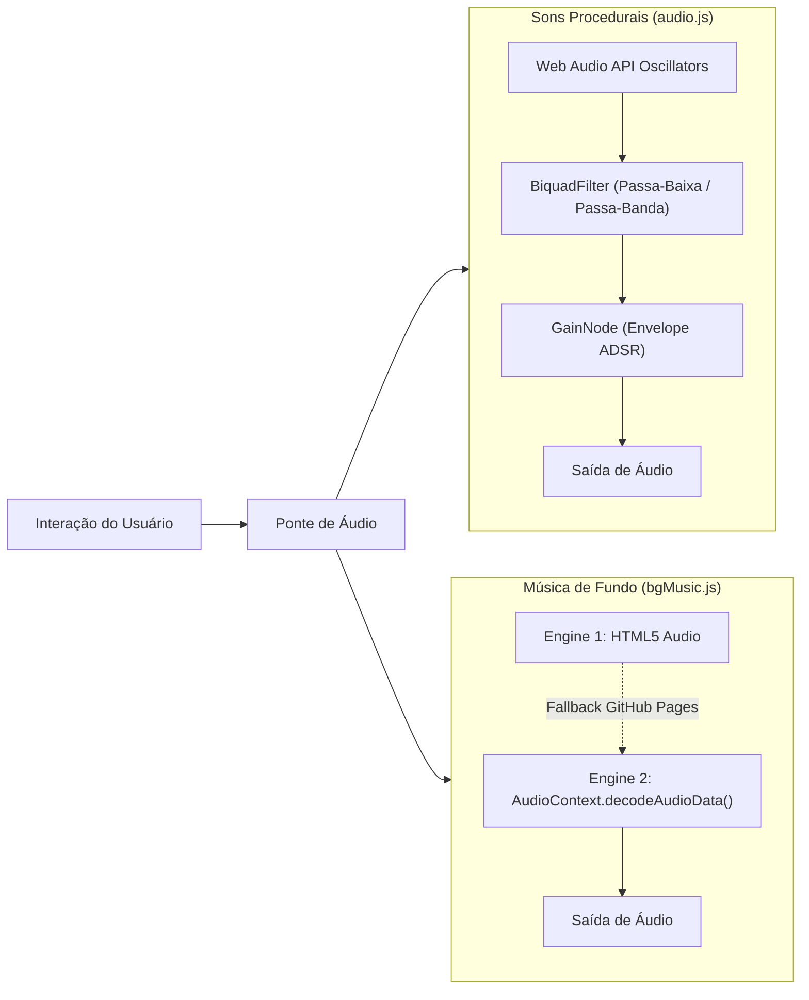

# 🏛️ Arquitetura do Sistema — Lumina Tarot

Documentação técnica e detalhada dos padrões de arquitetura, fluxo de dados, motor acústico e integração de inteligência artificial do **Lumina Tarot**.

---

## 📐 1. Visão Geral da Arquitetura

O Lumina Tarot opera sob o modelo **Jamstack Serverless Decoupled**:
- **Front-End SPA**: Construído em React 19 + Vite + Tailwind CSS + Framer Motion, hospedado em servidores estáticos de borda (GitHub Pages / Cloudflare Pages).
- **Backend Proxy Serverless**: Cloudflare Worker isolado responsável pela injeção da chave de API e roteamento de modelos do Google Gemini.
- **Armazenamento de Estado do Cliente**: `localStorage` com eventos reativos customizados para histórico, notas e preferências.

```mermaid
graph TB
    subgraph Client["Cliente / Navegador (React 19 SPA)"]
        App["App.jsx (Raiz + ErrorBoundary)"]
        Table["TarotTable.jsx (Estado da Mesa & Arcanos)"]
        Audio["audio.js & bgMusic.js (Web Audio Engine)"]
        History["history.js (Diário Oracular & LocalStorage)"]
        Export["cardImageExport.js (Canvas 2D / PNG)"]

        Modals["Modais Lazy-Loaded (Code-Splitting)"]
        Table --> Modals
        Modals --> Interpretation["InterpretationModal.jsx"]
        Modals --> HistoryModal["ReadingHistoryModal.jsx"]
        Modals --> Grimoire["GrimoireModal.jsx"]
        Modals --> Daily["DailyCardModal.jsx (Streak Tracker)"]
        Modals --> YesNo["YesNoOracleModal.jsx"]
    end

    subgraph Serverless["Borda Serverless (Cloudflare Worker)"]
        Worker["lumina-oracle Worker (CORS Restrito)"]
        SecretVault["Secret Vault (GEMINI_API_KEY)"]
        Worker --> SecretVault
    end

    subgraph ExternalAI["Google Generative Language API"]
        Gemini["Google Gemini (gemini-flash-latest)"]
    end

    Interpretation -->|POST / {question, cards, spread}| Worker
    Worker -->|Prompt Hermético + Auth Token| Gemini
    Gemini -->|Diagnóstico + Forças + Conselho| Worker
    Worker -->|JSON Seguro| Interpretation
    Interpretation -->|Grava com IA| History
    Interpretation -->|Gera Cartão PNG| Export
```

---

## 🎴 2. Ciclo de Vida do Baralho & Algoritmo de Embaralhamento

O baralho de 78 cartas é gerenciado no estado do componente `TarotTable`:
1. **Inicialização**: 78 arcanos são carregados de [`tarotDeck.js`](file:///c:/Users/joaopogo/Documents/Lumina/src/data/tarotDeck.js).
2. **Embaralhamento Fisher-Yates**:
   ```javascript
   const shuffleArray = (array) => {
     const shuffled = [...array];
     for (let i = shuffled.length - 1; i > 0; i--) {
       const j = Math.floor(Math.random() * (i + 1));
       [shuffled[i], shuffled[j]] = [shuffled[j], shuffled[i]];
     }
     return shuffled;
   };
   ```
3. **Animação em 4 Etapas (`DeckShuffleAnimation.jsx`)**:
   - *Fase 1: Corte (Split)* — Divisão do monte em duas metades.
   - *Fase 2: Riffle Weave* — Intercalação elástica com cliques sonoros procedurais.
   - *Fase 3: Leque Cósmico (Cosmic Arc Fan)* — Abertura em arco de 180°.
   - *Fase 4: Consagração & Coleta* — Reagrupamento e redistribuição para a mesa.

---

## 🎶 3. Motor Acústico Dual-Engine

O áudio do Lumina Tarot opera com latência zero e independência de plugins pesados:



---

## 🤖 4. Arquitetura do Oráculo de IA & Fallback Resiliente

O serviço [`aiOracle.js`](file:///c:/Users/joaopogo/Documents/Lumina/src/utils/aiOracle.js) implementa uma estratégia de resiliência em três camadas:

1. **Camada 1: Cloudflare Worker com Google Gemini**:
   - Transmite a pergunta, posições e arcanos em prompt hermético.
   - Retorna as 3 seções arquetípicas estruturadas (*Diagnóstico da Intenção*, *Dinâmica das Forças Ocultas* e *Conselho Sagrado*).
2. **Camada 2: Parser Anti-Truncamento**:
   - Trata expressões regulares com tolerância a variações de quebra de linha.
   - Preenche lacunas automaticamente caso ocorra corte de rede.
3. **Camada 3: Motor Arquetípico Local (Offline)**:
   - Cruza a luz, sombra e conselho das cartas reveladas em algoritmo semântico puro executado no próprio navegador.
   - Zero dependência de conexão para consultas emergenciais.

---

## 🔒 5. Modelo de Segurança & Privacidade

- **Princípio do Menor Privilégio**: O front-end não possui permissão de escrita em nenhum banco de dados externo.
- **Zero Rastreamento / Telemetria Invasiva**: Nenhuma informação pessoal ou pergunta do consulente é enviada a servidores de analytics.
- **Isolamento de Chaves de API**: A chave do Google Gemini nunca toca o navegador do visitante.

---

<div align="center">
  <sub>Lumina Tarot • Arquitetura de Software & Design System</sub>
</div>
