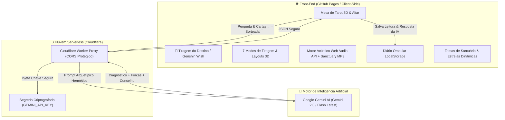

<div align="center">

# 🔮 LUMINA TAROT
### *Santuário dos Arcanos & Oráculo com Inteligência Artificial*

Um santuário oracular moderno, imersivo e visualmente deslumbrante para consultas de Tarot com 78 cartas clássicas, renderização espacial 3D, síntese acústica oracular via Web Audio API e **interpretações personalizadas em tempo real alimentadas por Inteligência Artificial Generativa**.

[](https://react.dev/)
[](https://vitejs.dev/)
[](https://workers.cloudflare.com/)
[](https://ai.google.dev/)
[](https://tailwindcss.com/)
[](https://www.framer.com/motion/)
[](https://developer.mozilla.org/en-US/docs/Web/API/Web_Audio_API)

</div>

---

## 🏛️ Arquitetura do Sistema



---

## ✨ Funcionalidades Principais

### 🤖 1. Oráculo com Inteligência Artificial Generativa
- Conexão em tempo real com os modelos mais avançados da Google (**Gemini 2.0 Flash / Flash Latest**).
- **Interpretações Inéditas e Vivas**: Não utiliza modelos de texto fixos. A IA compreende a semântica da pergunta mentalizada pelo consulente e cruza com a luz, sombra, posições e elementos de cada carta.
- **Divisão Sagrada em 3 Seções**:
  1. 🌌 **O Diagnóstico da Intenção**: Resposta acolhedora e direta ao dilema do consulente.
  2. 🔮 **A Dinâmica das Forças Ocultas**: Análise das tensões, bloqueios e potenciais invisíveis entre os arcanos.
  3. 🗝️ **O Conselho Sagrado do Oráculo**: Orientação prática e atitude transformadora recomendada.
- **100% Gratuito e Invisível**: Zero logins, zero janelas extras e privacidade total para os visitantes.
- **Fallback Arquetípico Nativo**: Motor semântico local que garante funcionamento instantâneo mesmo offline.

---

### 🌠 2. Tiragem Guiada pelo Destino *(Inspirada na Animação de Desejos de Jogos)*
- Botão animado e pulsante com feixes de luz dourada.
- **Animação Cinematográfica**:
  - Estrela cadente dourada rasgando o céu cósmico com cauda de faíscas em Canvas 2D.
  - Explosão estelar com sub-bass profundo e acorde de sinos ancestrais (`playWishLaunch`, `playStarImpact`).
  - Distribuição e materialização tridimensional em leque de todas as cartas restantes no altar.

---

### 🔮 3. 7 Modos de Tiragem com Layouts Espaciais 3D
1. **Carta Única** (1 Carta): Altar focal para orientações diárias ou dúvidas rápidas.
2. **Passado, Presente & Futuro** (3 Cartas): Linha temporal com fluxo de setas energéticas.
3. **Decisão & Ação** (3 Cartas): Pirâmide triádica (Situação, Ação e Desfecho).
4. **Mente, Corpo & Espírito** (3 Cartas): Alinhamento vertical dos 3 corpos da consciência.
5. **Templo dos Enamorados** (4 Cartas): Mandala em diamante para amor, sentimentos mútuos e harmonia de casal.
6. **Bússola do Alquimista** (4 Cartas): Geometria em cruz para carreira, vocação e prosperidade material.
7. **Cruz Céltica Tradicional** (10 Cartas): A cruz sagrada com a carta 2 cruzada a 90° sobre o cerne + Coluna de Ascensão.

---

### ⚖️ 4. Oráculo do Sim ou Não
- Modo oracular dedicado para perguntas diretas e objetivas.
- **Veredito Instantâneo**: *SIM CONVICTO*, *NÃO / CAUTELA* ou *NEUTRO / EM TRANSFORMAÇÃO*.
- **Medidor de Polaridade Cósmica**: Barra de intensidade com nuances de cartas invertidas e conselho objetivo.

---

### 📖 5. Diário Oracular & Histórico em Tempo Real
- Gravação persistente no `localStorage` com sincronização reativa por eventos (`lumina_history_updated`).
- **Histórico Completo**: Grava a data, a pergunta do consulente, todas as cartas tiradas e a **revelação viva completa gerada pela IA**.
- Campo de busca instantânea por cartas, perguntas ou termos da resposta do oráculo.
- Campo de notas e reflexões pessoais editáveis para cada leitura.

---

### 🔍 6. Inspeção de Arcanos na Interpretação
- Todas as cartas na tela da interpretação completa são interativas.
- Ao clicar em qualquer carta, abre-se o visualizador detalhado com a arte ampliada, correspondências astrológicas, conselho sagrado e o significado contextual exato da posição em que caiu na mesa.

---

### 🎨 7. Sistema de Temas do Santuário
Quatro atmosferas visuais com paletas HSL personalizadas e recoloração em tempo real das nebulosas e estrelas:
- 🌌 **Noite Cósmica** (Padrão): Índigo profundo e ouro estelar.
- 🌙 **Luar Místico**: Azul petróleo abissal e ciano prateado.
- ☀️ **Alquimia Solar**: Vinho âmbar, cobre e dourado solar.
- 🌹 **Veludo Carmesim**: Púrpura escuro, magenta e ouro nobre.

---

### 🎧 8. Áudio Oracular & Música Ambiente Dual-Engine
- **Música de Fundo (*Sanctuary*)**:
  - Arquitetura **Dual-Engine** ([`bgMusic.js`](file:///c:/Users/joaopogo/Documents/Lumina/src/utils/bgMusic.js)) com HTML5 Audio + Web Audio API (`fetch` e `decodeAudioData`) para compatibilidade 100% perfeita com servidores estáticos do **GitHub Pages** (sem dependência de cabeçalhos HTTP 206 Range).
- **Sintetizador Acústico Nativo (Web Audio API)**:
  - Síntese pura com latência zero para cliques de cartas, farfalhar de pergaminho (*Paper Rustle*), sinos pentatônicos (*Hover Chimes*) e explosões estelares (*Star Impact*).

---

### 📱 9. Mobile Floating Bottom Dock & Acessibilidade
- **Barra de Navegação Inferior**: Menu flutuante anatômico para polegares em smartphones (*Altar, Destino 🌠, Sim/Não, Grimório, Diário, Temas*).
- **Atalhos Globais de Teclado**:
  - `Espaço`: Embaralhar 3D
  - `D`: Tiragem Guiada pelo Destino
  - `G`: Abrir Grimório dos 78 Arcanos
  - `H`: Abrir Diário Oracular
  - `T`: Alternar Temas do Santuário
  - `Z`: Ativar/Desativar Modo Zen (foco total na mesa)
  - `M`: Ligar/Desligar Música Ambiente
  - `Esc`: Fechar modais ativos

---

## 🛠️ Tecnologias Utilizadas

| Tecnologia | Finalidade |
| :--- | :--- |
| **React 19** | Biblioteca de interface reativa e componentes modulares |
| **Vite 6** | Bundler e servidor de desenvolvimento ultrarrápido |
| **Google Gemini API** | Inteligência artificial generativa para diagnósticos profundos |
| **Cloudflare Workers** | Proxy serverless para proteção de chaves e conexão segura |
| **Tailwind CSS v4** | Design system e estilização com aceleração por GPU |
| **Framer Motion** | Física de molas (*Spring Physics*), transições 3D e elevação tátil |
| **Web Audio API** | Síntese de áudio procedural e decodificação na memória |
| **Canvas API (2D)** | Renderização de estrelas cintilantes, nebulosas e rastro de meteoros |
| **Lucide React** | Ícones vetoriais modernos |

---

## 🚀 Como Executar o Projeto Localmente

### Pré-requisitos
- [Node.js](https://nodejs.org/) (v18 ou superior)
- `npm` ou `yarn`

### 1. Clonar o repositório
```bash
git clone https://github.com/SEU_USUARIO/lumina-tarot.git
cd lumina-tarot
```

### 2. Instalar dependências
```bash
npm install
```

### 3. Configurar variáveis de ambiente (Opcional)
Crie um arquivo `.env` na raiz do projeto:
```env
VITE_ORACLE_API_URL=https://lumina-oracle.jpedrooliveiragritz.workers.dev
```

### 4. Executar em modo de desenvolvimento
```bash
npm run dev
```
Acesse em seu navegador: **`http://localhost:5173/`**

### 5. Compilar para produção
```bash
npm run build
```

---

## 🔒 Segurança & Privacidade

- **Zero Chaves no Front-End**: Nenhuma chave de API privada fica exposta no código-fonte do cliente ou no GitHub Pages.
- **Isolamento de Dados**: Todo o histórico de leituras e notas pessoais reside **exclusivamente no `localStorage` do navegador do usuário**.
- **Auditado**: Repositório 100% auditado contra vazamentos de credenciais ou tokens sensíveis.

---

<div align="center">
  <sub>Lumina Tarot • Desenvolvido com reverência à tradição hermética e à vanguarda da tecnologia web.</sub>
</div>
